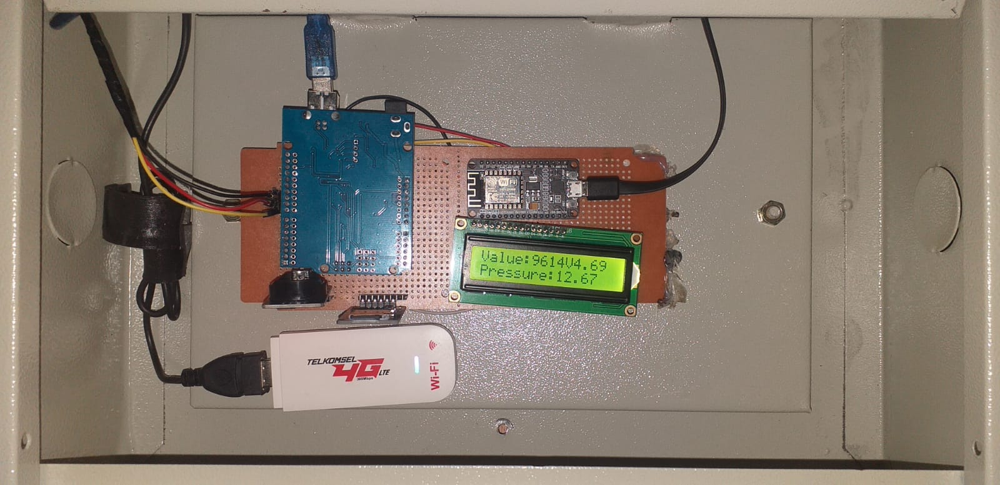
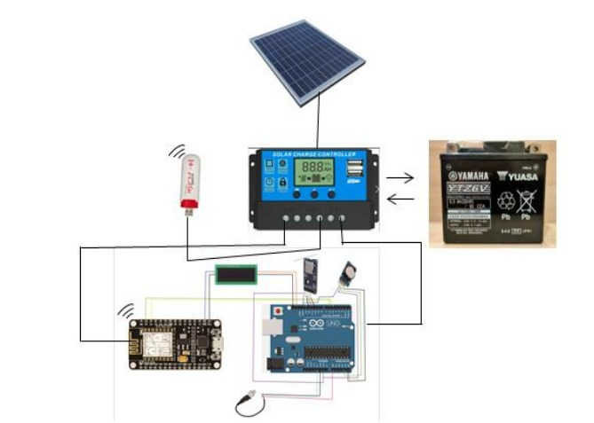
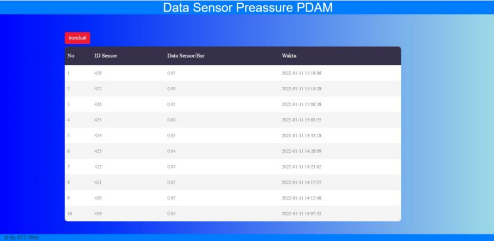

# Monitoring_Tekanan_Air
 Menggunakan Sensor Pressure untuk monitoring tekanan air, Sensor ini akan mendeteksi tekanan air dalam pipa selanjutnya di terima oleh arduino uno data sensornya, oleh arduino uno akan dikirim ke nodemcu esp 8266 
 untuk diteruskan ke database 

 ## alat

## rancangan

## ala 

## web 

